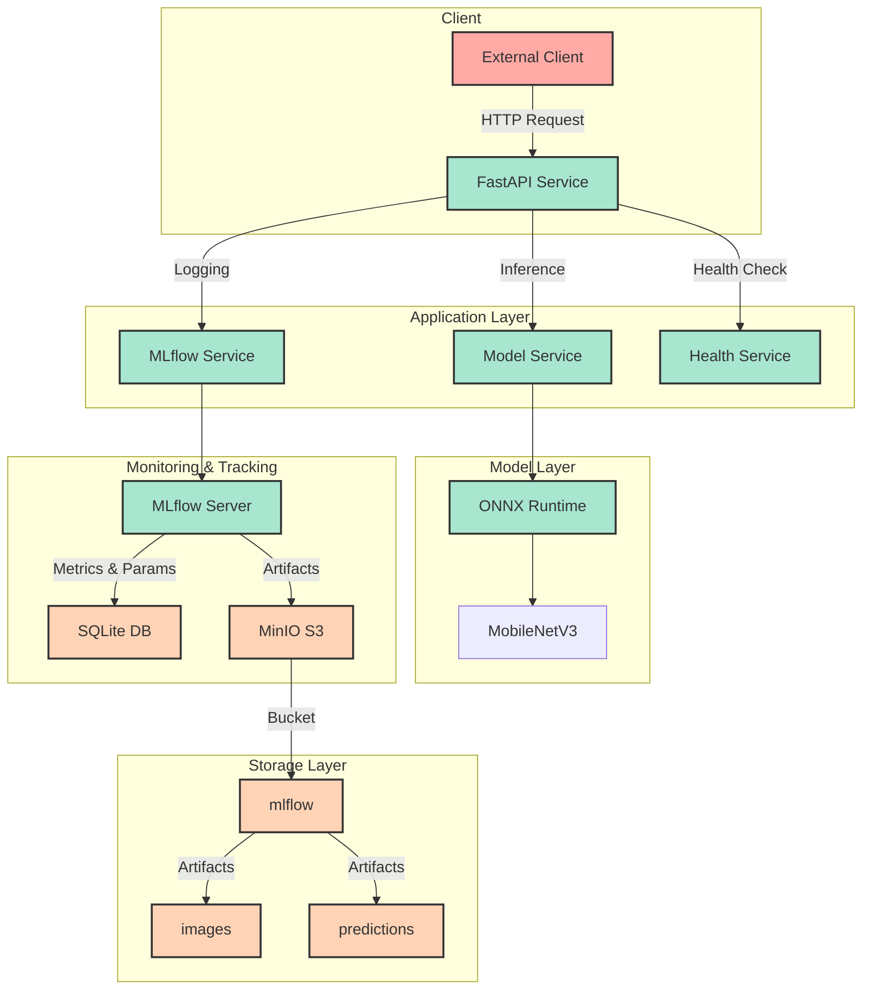

# ML Model Inference Service

이미지 분류를 위한 MLOps 기반의 머신러닝 모델 서비스입니다. FastAPI를 통한 RESTful API 제공, MLflow를 통한 실험 추적, MinIO를 통한 아티팩트 관리 기능을 제공합니다.

## 주요 기능

### 1. 이미지 분류 서비스
- MobileNetV3 ONNX 모델을 사용한 실시간 이미지 분류
- 상위 5개 예측 결과 및 신뢰도 제공
- 효율적인 모델 서빙을 위한 ONNX Runtime 사용

### 2. MLflow 실험 관리
- 모든 추론 결과의 자동 로깅
- 예측 결과, 신뢰도, 메타데이터 추적
- 입력 이미지 및 예측 결과 아티팩트 저장
- 실험 이력 조회 및 비교 기능

### 3. 확장 가능한 아키텍처
- 컨테이너 기반 마이크로서비스 아키텍처
- MinIO S3 호환 스토리지를 통한 확장 가능한 아티팩트 저장
- 상태 모니터링 및 헬스체크 기능

### 4. 개발자 친화적 환경
- Poetry를 통한 의존성 관리
- FastAPI의 자동 API 문서화
- Docker Compose를 통한 간편한 배포

## 시스템 아키텍처



## 프로젝트 구조

```plaintext
.
├── app/
│   ├── __init__.py
│   ├── main.py                 # FastAPI 애플리케이션 진입점
│   ├── routers/
│   │   ├── __init__.py
│   │   ├── router_svc.py      # 추론 API 라우터
│   │   ├── mlflow.py          # MLflow 관련 API 라우터
│   │   └── health.py          # 헬스체크 API 라우터
│   ├── services/
│   │   ├── __init__.py
│   │   ├── inference_service.py  # 모델 추론 서비스
│   │   ├── mlflow_service.py    # MLflow 실험 추적 서비스
│   │   └── health_service.py    # 시스템 상태 모니터링 서비스
│   └── schemas/
│       ├── __init__.py
│       ├── dto_define.py        # 추론 관련 데이터 모델
│       └── mlflow.py           # MLflow 관련 데이터 모델
├── models/                     # 모델 파일 디렉토리
│   └── mobilenetv3.onnx       # ONNX 모델 파일
├── tests/                     # 테스트 코드
│   └── __init__.py
├── docker-compose.yml         # 도커 컴포즈 설정
├── Dockerfile                 # FastAPI 서비스 도커 파일
├── pyproject.toml            # Poetry 프로젝트 설정
├── poetry.lock              # Poetry 의존성 잠금 파일
└── README.md                # 프로젝트 문서

```

### 주요 컴포넌트 설명

#### API 라우터
- **router_svc.py**: 이미지 분류 추론 API
- **mlflow.py**: MLflow 실험 추적 API
- **health.py**: 시스템 상태 확인 API

#### 서비스 레이어
- **inference_service.py**: 
  - ONNX 모델 로딩
  - 이미지 전처리
  - 추론 실행
  
- **mlflow_service.py**:
  - 실험 관리
  - 메트릭 로깅
  - 아티팩트 저장
  
- **health_service.py**:
  - 시스템 리소스 모니터링
  - 모델 상태 확인
  - GPU 상태 확인

#### 데이터 모델
- **dto_define.py**:
  - InferenceInput: 추론 요청 모델
  - InferenceResponse: 추론 응답 모델
  - PredictionResult: 예측 결과 모델

- **mlflow.py**:
  - MLflowRunResponse: 실행 정보 응답 모델
  - MLflowLogResponse: 로깅 응답 모델
  - PredictionLogRequest: 예측 로그 요청 모델

#### 인프라 설정
- **docker-compose.yml**: 
  - FastAPI 서비스
  - MLflow 서버
  - MinIO 스토리지
  - 리소스 제한 및 헬스체크

- **Dockerfile**:
  - Python 3.10 기반
  - Poetry 의존성 관리
  - 멀티스테이지 빌드

## 클론

```bash
git clone <repository-url>
cd <repository-name>
```

## 환경 설정

```bash
cp .env.example .env
```

.env 파일 수정

## 실행

```bash
# 서비스 시작
docker-compose up -d

# 서비스 중지 및 컨테이너 제거
docker-compose down

# 모든 Docker 리소스 완전 제거
docker-compose down --rmi all --volumes --remove-orphans  # 컨테이너, 이미지, 볼륨 모두 제거
docker system prune -a --volumes  # 사용하지 않는 모든 Docker 리소스 제거 (주의: 모든 이미지와 볼륨이 삭제됨)
```

## API 명세

### 예측 요청

```bash
POST /api/v1/predict
Content-Type: application/json
{
    "image_path": "/path/to/image.jpg"
}
```

### 예측 로그 기록

```bash
POST /api/v1/mlflow/log-prediction
Content-Type: application/json
{
    "image_path": "/path/to/image.jpg",
    "predictions": [["cat", 0.95], ["dog", 0.05]],
    "model_version": "v1.0.0"
}
```

### 헬스 체크

```bash
GET /api/v1/health
```

### MLflow 실행 정보 조회

```bash
GET /api/v1/mlflow/runs/{run_id}
```

- **API 엔드포인트**: http://localhost:9000

## MLflow와 MinIO 구조

```plaintext
mlflow/
├── artifacts/
│   ├── {run_id}/
│   │   ├── input_images/
│   │   │   └── {image_name}
│   │   └── prediction_results/
│   │       └── prediction_{timestamp}.txt
```

## 설치

### Poetry 설치

```bash
pip install poetry
```

### 종속성 설치

```bash
poetry install
```

### 애플리케이션 실행

```bash
poetry run uvicorn app.main:app --reload
```

## 라이선스

MIT License

## 기여하기

1. Fork the Project
2. Create your Feature Branch (`git checkout -b feature/AmazingFeature`)
3. Commit your Changes (`git commit -m 'Add some AmazingFeature'`)
4. Push to the Branch (`git push origin feature/AmazingFeature`)
5. Open a Pull Request

